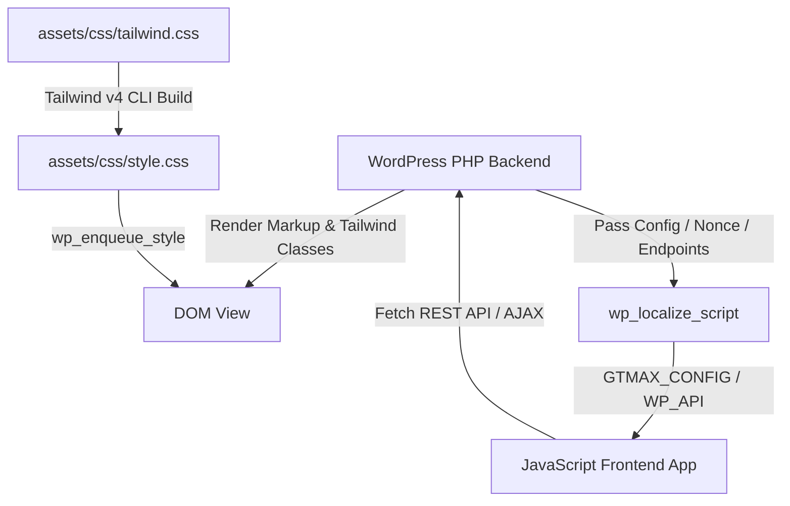

# WordPress PHP + JavaScript + Tailwind CSS Workflow Guide

This skill defines the technical standards, code quality principles, and architectural patterns for building **reusable**, **maintainable**, and **readable** WordPress themes, plugins, and custom features powered by **WordPress PHP**, **JavaScript**, and **Tailwind CSS**.

---

## 1. Core Code Quality Principles

All code written or refactored under this stack MUST adhere strictly to three core engineering pillars:

### A. Reusability (DRY - Don't Repeat Yourself)
* **Modular PHP Helpers**: Extract repetitive logic (such as response formatting, template tags, or remote API calls) into standalone helper functions in `functions.php` or dedicated include files (`inc/`).
* **Reusable UI Components**: For recurring UI elements (e.g., buttons, cards, modals), build dedicated PHP template partials (e.g., `template-parts/components/card.php`) or reuse Tailwind CSS `@utility` / `@layer components`.
* **Shared JavaScript Utilities**: Place API fetch logic, error alerts, and form validation in shared utility functions rather than duplicating `fetch()` and DOM manipulation across multiple script files.

### B. Maintainability (Clean Architecture & Reliability)
* **Single Responsibility**: Each function or module must have one clear purpose. Keep PHP controllers separate from view rendering, and isolate JS API fetching from UI rendering.
* **Centralized Configuration**: Pass all environment-specific data (nonces, API URLs, page redirects) from PHP to JS via `wp_localize_script()` (`GTMAX_CONFIG`). Never hardcode API endpoints in frontend JavaScript files.
* **Defensive Coding & Security**: Always check for variable existence, validate nonces (`check_ajax_referer` / `wp_verify_nonce`), sanitize all inputs (`sanitize_text_field`, `absint`), and handle network/API errors gracefully with `try/catch`.

### C. Readability (Self-Documenting & Clean Formatting)
* **Descriptive Naming Conventions**:
  * **PHP Functions**: Use explicit prefixes and verbs, e.g., `gtmax_get_user_quotation()`, `gtmax_enqueue_payment_assets()`.
  * **JS Variables & Functions**: Use camelCase with clear domain names, e.g., `paymentFormElement`, `handleQuotationSubmit()`.
  * **HTML IDs / Data Attributes**: Use kebab-case with explicit names, e.g., `id="quotation-submit-btn"`, `data-quotation-id="123"`.
* **Comprehensive Docblocks**: Document PHP functions with PHPDoc (`/** @param ... @return ... */`) and JS functions with JSDoc, explaining purpose, input parameters, and return types.
* **Clean & Logical Formatting**: Keep functions small and focused, group related code logically, and format Tailwind utility classes cleanly.

---

## 2. Stack Architecture Overview



* **Backend (PHP)**: Custom page templates (`page-*.php`), theme `functions.php`, custom post types, REST API endpoints (`register_rest_route`), AJAX handlers (`wp_ajax_*`), input sanitization, database operations (`$wpdb`), and nonce security.
* **Frontend Logic (JavaScript)**: Modularity in `assets/js/`, async fetching (`fetch` / `jQuery.ajax`), DOM state binding, form handling, modal management, and dynamic element rendering.
* **Styling (Tailwind CSS)**: Utility-first CSS using Tailwind v4 (`@tailwindcss/cli`), built from source `assets/css/tailwind.css` to `assets/css/style.css`, cache-busted with `filemtime()`.

---

## 3. Tailwind CSS Setup & Asset Management

### A. CSS Entry Point (`assets/css/tailwind.css`)
In Tailwind v4, use standard CSS import and custom utilities:
```css
@import "tailwindcss";

/* Reusable component styles / utility layer extensions */
@layer utilities {
  .shadow-soft {
    box-shadow: 0 10px 25px -5px rgba(0, 0, 0, 0.05);
  }
}
```

### B. Build Command (`package.json`)
```json
{
  "name": "gtmax-theme",
  "version": "1.0.0",
  "scripts": {
    "build": "tailwindcss -i ./assets/css/tailwind.css -o ./assets/css/style.css --watch"
  },
  "devDependencies": {
    "@tailwindcss/cli": "^4.0.0",
    "tailwindcss": "^4.0.0"
  }
}
```

### C. PHP Asset Enqueuing with Cache-Busting (`functions.php`)
Always use `filemtime()` to ensure browsers load newly compiled CSS/JS immediately without stale caching:

```php
/**
 * Enqueue Main Tailwind Stylesheet with automatic cache-busting.
 *
 * @return void
 */
function gtmax_enqueue_styles() {
    $css_path = get_template_directory() . '/assets/css/style.css';
    $css_uri  = get_template_directory_uri() . '/assets/css/style.css';

    if (file_exists($css_path)) {
        wp_enqueue_style(
            'gtmax-style',
            $css_uri,
            array(),
            filemtime($css_path)
        );
    }
}
add_action('wp_enqueue_scripts', 'gtmax_enqueue_styles');
```

---

## 4. Passing Backend PHP Data to JavaScript (`wp_localize_script`)

Never hardcode URLs, nonces, or environment secrets in JavaScript files. Always expose configuration from PHP to JS securely using `wp_localize_script()` or conditional script loading.

### PHP Implementation (`functions.php`)
```php
/**
 * Enqueue Page-Specific Script with Localized Server Data.
 *
 * @return void
 */
function gtmax_enqueue_feature_assets() {
    // Target specific page templates or pages
    if (!is_page_template('page-payment.php') && !is_page('insurance-payment')) {
        return;
    }

    $js_path = get_template_directory() . '/assets/js/payment.js';
    $js_uri  = get_template_directory_uri() . '/assets/js/payment.js';

    // 1. Enqueue Third-Party Libraries (e.g. SweetAlert2)
    wp_enqueue_script(
        'sweetalert2',
        'https://cdn.jsdelivr.net/npm/sweetalert2@11',
        array(),
        null,
        true
    );

    // 2. Enqueue Feature JS
    wp_enqueue_script(
        'gtmax-payment',
        $js_uri,
        array('jquery', 'sweetalert2'),
        file_exists($js_path) ? filemtime($js_path) : '1.0.0',
        true
    );

    // 3. Localize PHP Data to JS Window Object
    wp_localize_script('gtmax-payment', 'GTMAX_CONFIG', array(
        'ajaxUrl'      => admin_url('admin-ajax.php'),
        'restUrl'      => esc_url_raw(rest_url('gtmax/v1/')),
        'nonce'        => wp_create_nonce('gtmax_secure_action'),
        'lang'         => get_locale(),
        'quotationUrl' => home_url('/insurance-quotation/'),
        'paymentUrl'   => home_url('/insurance-payment/'),
    ));
}
add_action('wp_enqueue_scripts', 'gtmax_enqueue_feature_assets');
```

---

## 5. WordPress PHP Backend API Patterns

### Option A: WP REST API (Recommended for modern JS apps)

```php
/**
 * Register Custom REST API Route
 */
add_action('rest_api_init', function () {
    register_rest_route('gtmax/v1', '/submit-form', array(
        'methods'             => 'POST',
        'callback'            => 'gtmax_handle_rest_submission',
        'permission_callback' => 'gtmax_verify_rest_permissions',
    ));
});

/**
 * Verify REST Request Permission using WP Nonce
 *
 * @param WP_REST_Request $request
 * @return bool|WP_Error
 */
function gtmax_verify_rest_permissions(WP_REST_Request $request) {
    $nonce = $request->get_header('X-WP-Nonce');
    return wp_verify_nonce($nonce, 'wp_rest');
}

/**
 * Handle REST Form Submission
 *
 * @param WP_REST_Request $request
 * @return WP_REST_Response
 */
function gtmax_handle_rest_submission(WP_REST_Request $request) {
    $email = sanitize_email($request->get_param('email'));
    $name  = sanitize_text_field($request->get_param('name'));

    if (empty($email) || !is_email($email)) {
        return new WP_REST_Response(array(
            'success' => false,
            'message' => __('Invalid email address provided.', 'gtmax'),
        ), 400);
    }

    // Reusable response format
    return new WP_REST_Response(array(
        'success' => true,
        'message' => __('Submission successful!', 'gtmax'),
        'data'    => array('name' => $name, 'email' => $email),
    ), 200);
}
```

### Option B: WordPress Admin AJAX (`admin-ajax.php`)

```php
/**
 * Register AJAX Handlers for Authenticated and Guest Users
 */
add_action('wp_ajax_gtmax_process_action', 'gtmax_handle_ajax_process');
add_action('wp_ajax_nopriv_gtmax_process_action', 'gtmax_handle_ajax_process');

/**
 * Process AJAX Request with Security and Input Sanitization
 *
 * @return void
 */
function gtmax_handle_ajax_process() {
    // 1. Verify Nonce Security
    check_ajax_referer('gtmax_secure_action', 'security');

    // 2. Sanitize Inputs
    $user_id = isset($_POST['user_id']) ? absint($_POST['user_id']) : 0;
    $amount  = isset($_POST['amount']) ? floatval($_POST['amount']) : 0.0;

    if ($amount <= 0) {
        wp_send_json_error(array('message' => 'Invalid transaction amount.'));
    }

    // 3. Return Standard JSON Response
    wp_send_json_success(array(
        'message' => 'Transaction processed successfully.',
        'amount'  => $amount
    ));
}
```

---

## 6. JavaScript Frontend Controller Pattern

Create modular, maintainable JS files in `assets/js/` that separate DOM manipulation from API communications:

```javascript
/**
 * Feature Controller: Handles dynamic AJAX/REST interaction & Tailwind UI updates
 */
document.addEventListener('DOMContentLoaded', () => {
  const formElement = document.getElementById('gtmax-interactive-form');
  const submitBtn   = document.getElementById('submit-btn');
  const responseBox = document.getElementById('response-message');

  if (!formElement) return;

  /**
   * Updates button state during async operations
   * @param {boolean} isLoading
   */
  const setBtnLoadingState = (isLoading) => {
    submitBtn.disabled = isLoading;
    if (isLoading) {
      submitBtn.classList.add('opacity-50', 'cursor-not-allowed');
      submitBtn.innerText = 'Processing...';
    } else {
      submitBtn.classList.remove('opacity-50', 'cursor-not-allowed');
      submitBtn.innerText = 'Submit Request';
    }
  };

  /**
   * Displays response alert message in UI
   * @param {string} message 
   * @param {boolean} isSuccess 
   */
  const renderResponseMessage = (message, isSuccess) => {
    const baseClasses = 'p-4 mb-4 text-sm rounded-lg ';
    const themeClasses = isSuccess 
      ? 'text-green-800 bg-green-50 dark:bg-gray-800 dark:text-green-400' 
      : 'text-red-800 bg-red-50 dark:bg-gray-800 dark:text-red-400';

    responseBox.className = baseClasses + themeClasses;
    responseBox.innerHTML = message;
    responseBox.classList.remove('hidden');
  };

  formElement.addEventListener('submit', async (e) => {
    e.preventDefault();

    setBtnLoadingState(true);

    const formData = new FormData(formElement);
    formData.append('action', 'gtmax_process_action');
    formData.append('security', GTMAX_CONFIG.nonce);

    try {
      // Async API Communication
      const response = await fetch(GTMAX_CONFIG.ajaxUrl, {
        method: 'POST',
        body: formData
      });

      const result = await response.json();

      if (result.success) {
        renderResponseMessage(result.data.message, true);

        if (typeof Swal !== 'undefined') {
          Swal.fire({
            icon: 'success',
            title: 'Success!',
            text: result.data.message,
            confirmButtonColor: '#2563eb'
          });
        }
      } else {
        throw new Error(result.data.message || 'An error occurred.');
      }
    } catch (error) {
      renderResponseMessage(error.message, false);
    } finally {
      setBtnLoadingState(false);
    }
  });
});
```

---

## 7. Reusable HTML / Page Template Pattern (`page-custom.php`)

Build structured HTML using Tailwind CSS utility classes and clean WordPress PHP template tags:

```php
<?php
/**
 * Template Name: GTMax Custom Feature Page
 */
get_header();
?>

<main class="min-h-screen bg-gray-50 dark:bg-gray-900 py-12 px-4 sm:px-6 lg:px-8">
  <div class="max-w-3xl mx-auto bg-white dark:bg-gray-800 rounded-2xl shadow-xl p-8 border border-gray-100 dark:border-gray-700">
    
    <!-- Header Section -->
    <div class="text-center mb-8">
      <h1 class="text-3xl font-extrabold text-gray-900 dark:text-white tracking-tight">
        <?php the_title(); ?>
      </h1>
      <p class="mt-2 text-sm text-gray-600 dark:text-gray-400">
        Fill out the details below to compute your quotation instantly.
      </p>
    </div>

    <!-- Alert Response Container -->
    <div id="response-message" class="hidden"></div>

    <!-- Form Section -->
    <form id="gtmax-interactive-form" class="space-y-6">
      <div>
        <label for="name" class="block text-sm font-medium text-gray-700 dark:text-gray-300">
          Full Name
        </label>
        <input 
          type="text" 
          name="name" 
          id="name" 
          required
          class="mt-1 block w-full rounded-md border-gray-300 shadow-sm focus:border-indigo-500 focus:ring-indigo-500 sm:text-sm px-4 py-2 border dark:bg-gray-700 dark:text-white dark:border-gray-600"
          placeholder="John Doe"
        />
      </div>

      <div>
        <label for="amount" class="block text-sm font-medium text-gray-700 dark:text-gray-300">
          Amount (MYR)
        </label>
        <input 
          type="number" 
          name="amount" 
          id="amount" 
          step="0.01" 
          required
          class="mt-1 block w-full rounded-md border-gray-300 shadow-sm focus:border-indigo-500 focus:ring-indigo-500 sm:text-sm px-4 py-2 border dark:bg-gray-700 dark:text-white dark:border-gray-600"
          placeholder="150.00"
        />
      </div>

      <button 
        type="submit" 
        id="submit-btn" 
        class="w-full flex justify-center py-3 px-4 border border-transparent rounded-lg shadow-sm text-sm font-medium text-white bg-blue-600 hover:bg-blue-700 focus:outline-none focus:ring-2 focus:ring-offset-2 focus:ring-blue-500 transition duration-150 ease-in-out"
      >
        Submit Request
      </button>
    </form>

  </div>
</main>

<?php
get_footer();
